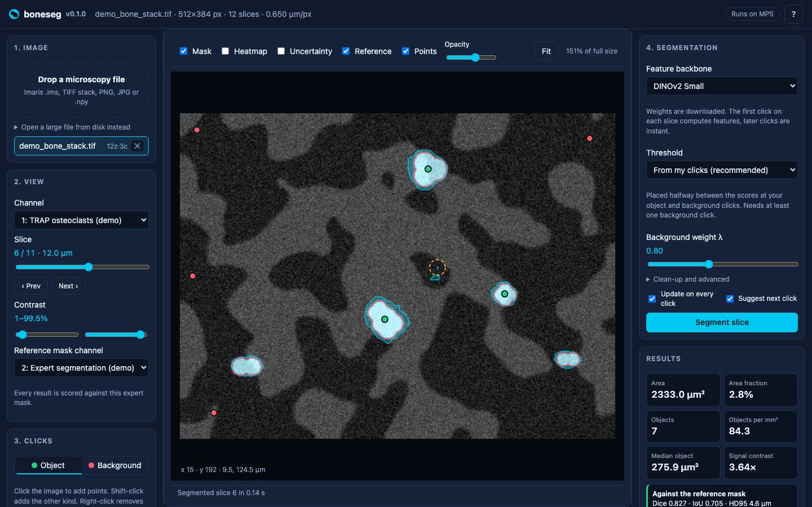

# boneseg

Segment structures in bone microscopy images with a few clicks. boneseg turns the DINO few-shot segmentation from the notebook in `notebooks/` into a web app. You open an Imaris, TIFF or PNG file, click a few cells and a few background spots, and get a mask with measurements in micrometres. From there you can run the whole z-stack, correct masks and train a small model on them, measure bone histomorphometry, and compare samples between groups.



## What it does

- **Segment from clicks.** A frozen DINOv2 backbone turns the image into patch features. Your clicks become prototypes, and the threshold is calibrated from them. The mask updates after every click.
- **Guide the next click.** An uncertainty overlay shows where the mask depends on single clicks, and a ring marks the most useful next click.
- **Several structures at once.** Segment, for example, cells and bone matrix together, each with its own clicks and colour.
- **Whole stacks.** Run every slice from one annotated slice, with measurements per slice, objects counted in 3D, and a side view through the stack.
- **Learn from corrections.** Fix a mask with a brush, save it as a label, and train a small model in seconds. It reports its accuracy on slices it has not seen.
- **Bone histomorphometry.** B.Ar/T.Ar, B.Pm, Oc.Pm/B.Pm and N.Oc/B.Pm per slice or across a stack, following the ASBMR nomenclature.
- **Compare samples.** Run a profile on every sample, put samples in groups, and compare them with a dot plot and a rank test.
- **Check against experts.** Pick an expert mask channel to score every result with Dice, IoU and HD95, and see where the mask is wrong.
- **Reuse and share.** Profiles carry clicks, learned models or several structures to new images, to other users and to batch runs.
- **Keep a record.** Export masks, label images and CSV tables, write an HTML report with a draft methods paragraph, or zip the whole project.

## Quick start

```bash
python3 -m venv .venv
source .venv/bin/activate
pip install -r requirements.txt
python -m boneseg serve --open
```

The app opens at http://127.0.0.1:8000. Click **Try a synthetic demo image** to explore it without your own data. The first time you pick a DINOv2 backbone, its weights download from Meta, about 85 MB for Small.

The app runs on an NVIDIA GPU, an Apple Silicon GPU or the CPU, whichever it finds. Small and Base are comfortable on a laptop. Giant needs a large GPU.

To share the app on a lab network, start it with `--host 0.0.0.0 --token SOME-SECRET` and send colleagues the access link it prints. Without a token, anyone who can reach the port can use the app. Opening files by path on the server is turned off on the network unless you add `--allow-paths`, since it would let anyone read files the server can read.

### With Docker

```bash
docker build -t boneseg .
docker run -p 8000:8000 -v "$PWD/projects:/data" boneseg
```

Add `-e BONESEG_TOKEN=some-secret` to require an access token, then open http://localhost:8000/?token=some-secret. The image is about 1.8 GB and runs on the CPU; DINOv2 weights download into the `/data` volume on first use. For an NVIDIA GPU, change the PyTorch wheel index in the Dockerfile to a CUDA one and add `--gpus all` to `docker run`.

## How to use it

1. **Open an image.** Drop a file on the left panel. Multi-gigabyte Imaris files open in place with "Open a large file from disk instead". Set the pixel size under "Pixel size" if the file has none.
2. **Set up the view.** Pick the channel that shows the structure. Optionally draw a region of interest (R), for example trabecular bone without the cortex. If the file has an expert segmentation channel, pick it as the reference mask; channels named "segmentation", "mask" or "surface" are picked up automatically.
3. **Click.** Click a few examples of the structure, then shift-click a few background spots. For several structures, click "+ Structure" and give each its own clicks; background clicks are shared.
4. **Refine.** Follow the hint under the click counts. Orange areas depend on single clicks, and the dashed ring marks where one more click helps most. With a reference mask, "Errors" shows extra pixels in red and missed ones in yellow.
5. **Correct and teach.** If the file already has expert masks, "Label 5 slices from the reference" turns them into labels, so the model learns from the experts and can then segment files that have no expert masks. Otherwise: press E to fix the mask with a brush and save it as a label. With several structures, the brush paints in the active structure's colour (Tab switches). After one or more labels, "Train model" fits a small classifier in seconds and reports its Dice on held-out slices. Switch to "Learned model" to segment new slices, with one or several structures, without clicks.
6. **Measure bone.** "Bone histomorphometry" combines a bone mask and a cell mask. Each mask can come from the current result, a structure, a profile, the learned model, a saved label or the reference channel. A multi-structure stack run with a structure named like bone or matrix also measures histomorphometry on every slice.
7. **Scale up.** "Run stack" segments a range of slices. "Save as profile" keeps the clicks, a learned model or all structures for other images. "Compare samples" at the top runs a profile on every sample and compares groups.
8. **Export.** Masks as PNG or TIFF, label images, per-object CSV with each object's intensity in every channel, stack outputs, an HTML report, or a project zip with everything except the image.

### Recipes

**Some files have expert masks, others do not** (as in the Liu data, where the last channel is the expert segmentation).
1. Open a file with expert masks and pick its image channel. The reference channel is picked up from its name.
2. Click "Label 5 slices from the reference", then "Train model". The summary shows the model's Dice against the expert mask on slices it was not trained on.
3. "Save model as profile". Open the other files, then in "Compare samples" run the profile on every sample, assign groups and compare.

**No expert masks.**
1. Click a few examples and background spots on one slice, and check the mask.
2. Press E to correct it, save it as a label, and repeat on two or three more slices spread through the stack ("Copy to next slice" helps).
3. "Train model", check the held-out Dice, and run the stack or a batch with the learned model.

**Osteoclast surface per sample.**
1. On a channel where both osteoclasts and bone are visible, click osteoclasts, then add a structure named "Bone matrix" and click bone. If they are on different channels, save a profile on each channel, pick them as the bone and cell sources under "Bone histomorphometry" and click "Measure the whole stack".
2. "Save as profile", then in "Compare samples" run it on every sample. Each run measures histomorphometry on every slice.
3. Compare Oc.Pm/B.Pm or N.Oc/B.Pm between groups.

### Keyboard shortcuts

| Key | Action |
|---|---|
| Click / Shift-click | Add an object / background point |
| Right-click | Remove the nearest point |
| 1, 2 | Switch between object and background clicks |
| Tab, Shift+Tab | With several structures, switch which one object clicks go to |
| Ctrl+Z | Undo the last point |
| , and . | Previous and next slice |
| F | Fit the image to the window |
| M, H, U | Toggle the mask, heatmap and uncertainty overlays |
| E, Esc | Start and cancel correcting the mask with a brush |
| [ and ], Ctrl+Z | While correcting: smaller or larger brush, undo the last stroke |
| R, Enter | Draw a region of interest and finish it |
| Alt-click | Move the side-view cut to this row |
| Scroll, drag | Zoom, pan |

## Batch processing

From the app, "Compare samples" can run a saved profile on every open sample. From the command line:

```bash
python -m boneseg profiles                       # List saved profiles and their ids
python -m boneseg batch data/*.ims --profile trap-cells-1a2b3c --channel 3 --z-step 5 --out results
```

Each file gets its own folder with a mask or label stack, per-slice measurements and a 3D object table. A combined `summary.csv` covers all files, and a file that fails is reported without stopping the rest. Add `--reference 4` to score every slice against an expert mask channel. On Liu file A, a profile made from one slice segmented 15 slices in 11 seconds on a MacBook, with a mean Dice of 0.61 against the expert mask.

## How it works

The image goes through a frozen, self-supervised DINOv2 backbone, which gives one feature vector per 14×14 pixel patch. The patches under your clicks become prototypes. Every patch is scored by its mean cosine similarity to the object prototypes, minus λ times its similarity to the background prototypes. The score map is upsampled and thresholded into a mask.

Several choices differ from the notebook. Each was measured with the benchmark scripts on the demo stack and on Liu file A (channel 3, scored against its masked channel 4).

- **The threshold comes from your clicks.** It sits halfway between the scores at the object clicks and those at the background clicks. Otsu tended to separate tissue from empty space instead of the target from everything else.
- **Scores are standardized per slice** by their median and spread. This never changes the slice you clicked, and it keeps the calibrated threshold meaningful on deeper, dimmer slices: stack Dice rose from 0.69 to 0.81 on a strongly degraded demo stack.
- **The image keeps its aspect ratio** when resized for the backbone, and measurements use the voxel size from the file.
- **Several structures** are each scored against the background and the other structures' clicks, and a pixel goes to the structure it resembles most among those whose threshold it clears. On a synthetic two-structure image this matched segmenting each structure alone (Dice 0.73 and 0.72 against 0.74 and 0.72).
- **The learned model** is the app's take on the notebook's supervised U-Net step: a linear or small two-layer classifier over the frozen patch features, fitted to the share of each patch covered by your corrected masks. Cross-validation picks the classifier and whether to add the mean features of the 5 × 5 neighbouring patches.

| Mean Dice on the demo stack, DINOv2 Small | Clicked slice | Whole stack |
|---|---|---|
| Otsu threshold | 0.58 | 0.36 |
| Fixed 6% of the image | 0.69 | 0.58 |
| Threshold from clicks (default) | 0.88 | 0.89 |

| Mean Dice on Liu file A, DINOv2 Small | From clicks | Otsu | Fixed 10% |
|---|---|---|---|
| Clicks on each slice, 3 object + 6 background | 0.58 | 0.51 | 0.56 |
| Clicks on each slice, 25 + 25 | 0.63 | 0.54 | 0.62 |
| Clicks on the middle slice, run over the stack, 25 + 25 | 0.57 | 0.50 | 0.56 |

| Learned model on Liu file A, Dice on 8 unseen slices | Dice |
|---|---|
| Clicking 25 + 25 on every slice, for comparison | 0.63 |
| Learned from 1 labelled slice | 0.67 |
| Learned from 4 labelled slices | 0.69 |

On real data most of the error is the mask spilling over the expert's boundary, which "Errors" makes visible. The learned model is the most effective way to reduce it.

### Tried and left out

Each of these was measured and did not hold up, so the defaults stay simpler:

- An adaptive stack mode that refreshed the prototypes slice by slice lowered Dice in every setting, for example from 0.78 to 0.59.
- Three channels as a colour image scored the same or worse than one grey channel (0.63 to 0.65, against 0.65 for grey).
- Tuning the input size and λ on one labelled slice made other slices worse (0.61 against 0.64).
- Half-patch-shifted passes to double the feature resolution scored 0.61 against 0.65. A stricter threshold helped with 25 clicks but hurt with 3.
- Flip-averaged features and features from two layers did not help (0.64 against 0.65).
- Earlier transformer blocks did worse for Small and Base (Small: 0.60 for the second-last and 0.56 for the fourth-last block, against 0.65 for the last, with 25 + 25 clicks). On the notebook's Kaggle run, tuning picked the fourth-last block for Giant, which has 40 blocks, so the best depth depends on the backbone; the "Transformer block" setting is under "Clean-up and advanced".
- Neighbourhood features for click-based segmentation gained about 0.015 on Liu file A but lost 0.07 on the demo's small cells.

On Liu file A a smaller backbone input of 644 px did slightly better than the default 980 px (0.66 against 0.65 with 25 + 25 clicks), and Base was close to Small. Try the "Detail" setting under "Clean-up and advanced" if a mask looks too fragmented.

Run the benchmarks yourself:

```bash
python scripts/benchmark_demo.py --ref top --depth-degradation 1.0
python scripts/benchmark_file.py "data/liudata/10-26-40_6_Blaze_crop2 quantified.ims" --channel 3 --reference 4
python scripts/benchmark_head.py "data/liudata/10-26-40_6_Blaze_crop2 quantified.ims" --channel 3 --reference 4
```

## Using it from Python

Every step is a plain function. `notebooks/boneseg_quickstart.ipynb` walks through loading a stack, segmenting from clicks, measuring, running the stack, histomorphometry and training the learned model. The web API is documented at http://127.0.0.1:8000/docs while the app runs.

## References

- Oquab M, et al. DINOv2: Learning robust visual features without supervision. Transactions on Machine Learning Research (2024). The backbone.
- Dempster DW, et al. Standardized nomenclature, symbols, and units for bone histomorphometry: a 2012 update of the report of the ASBMR Histomorphometry Nomenclature Committee. J Bone Miner Res 28:2–17 (2013). The histomorphometry names and definitions.

## Project layout

| Path | Contents |
|---|---|
| `boneseg/io.py` | Lazy loading of Imaris, TIFF, PNG/JPG and NumPy files as (channel, z, y, x) volumes |
| `boneseg/backbone.py` | DINOv2 backbones pinned to a fixed commit, plus a fast "classic" backbone for tests and offline use |
| `boneseg/segment.py` | Prototypes, scores, thresholds, clean-up, uncertainty, several structures and profiles |
| `boneseg/head.py` | The learned model trained on corrected masks |
| `boneseg/pipeline.py`, `batch.py` | Whole-stack runs and command-line batch runs |
| `boneseg/quantify.py`, `metrics.py`, `histo.py` | Measurements in micrometres, 3D objects, Dice, IoU, HD95 and histomorphometry |
| `boneseg/study.py`, `report.py` | Group comparisons and HTML reports |
| `boneseg/api/`, `store.py` | The web server, one module per area, and its storage |
| `boneseg/static/` | The browser interface: plain HTML, CSS and JavaScript files in `js/`, loaded in order without a build step |
| `notebooks/` | The research notebook, with a Kaggle batch-run setup in `kernel-metadata.json`, and the quickstart notebook |
| `scripts/` | Benchmarks |
| `tests/` | Unit, API, file-format and browser tests on synthetic images |
| `ci/` | A GitHub Actions workflow, ready to enable (see `ci/README.md`) |

## Development

```bash
pip install -r requirements-dev.txt
pytest
```

The browser tests in `tests/e2e` drive the real interface on the demo stack. They need Playwright and are skipped without it:

```bash
pip install playwright && python -m playwright install chromium
pytest tests/e2e
```

Uploaded files, profiles and job outputs go to `projects/`, or to the folder set with `--data-dir` or the `BONESEG_DATA_DIR` environment variable. Microscopy files and outputs are kept out of git.
