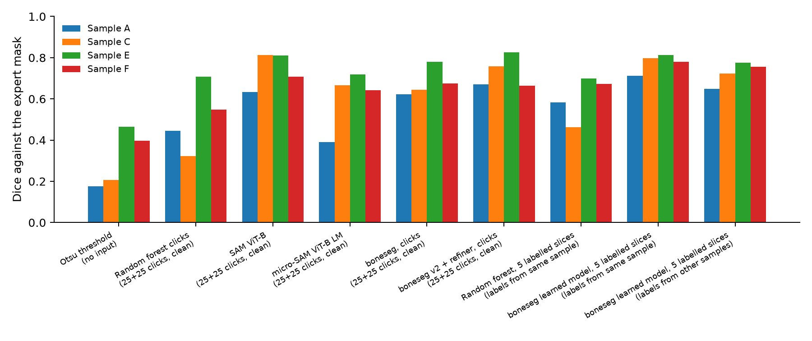
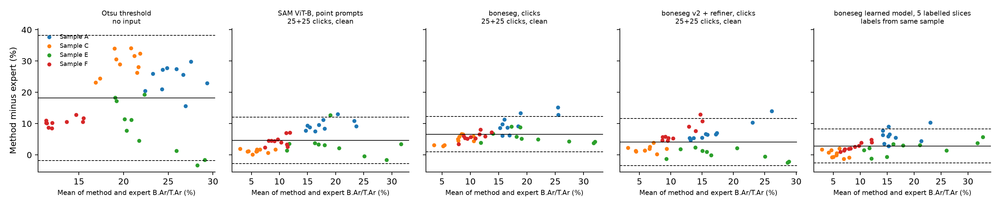
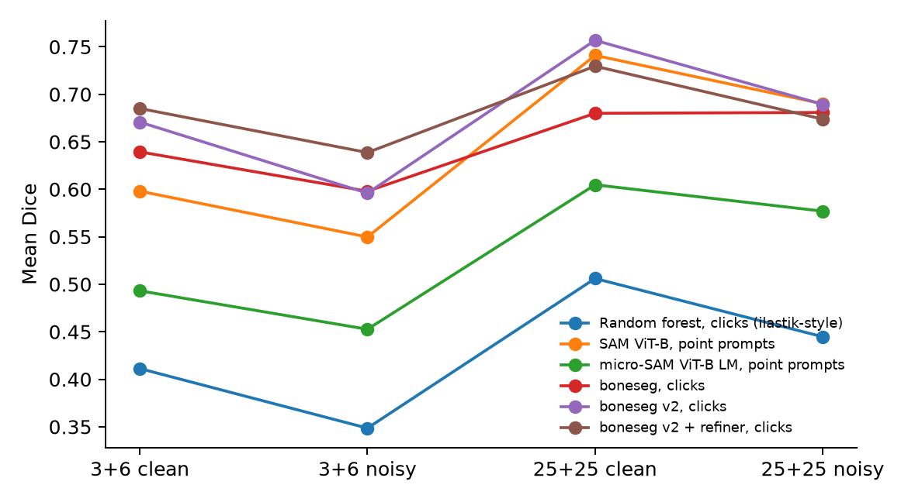

# Evaluation results

Samples: A, C, E, F. Nested leave-one-sample-out; settings tuned on the other samples only. Method version: tag `method-v1 and method-v2`. Click seeds: [0, 1, 2]. Run time 134.3 min.

**Caveat:** with 4 samples the confidence intervals mostly reflect variation between these samples; they are not a substitute for more samples.

## Dice per method

| Method | Condition | A | C | E | F | Mean (95% CI) |
|---|---|---|---|---|---|---|
| Otsu threshold | no input | 0.177 | 0.208 | 0.464 | 0.396 | 0.311 (0.188–0.446) |
| Random forest, clicks (ilastik-style) | 25+25 clicks, clean | 0.445 | 0.324 | 0.708 | 0.548 | 0.506 (0.375–0.653) |
| SAM ViT-B, point prompts | 25+25 clicks, clean | 0.633 | 0.813 | 0.811 | 0.707 | 0.741 (0.664–0.815) |
| micro-SAM ViT-B LM, point prompts | 25+25 clicks, clean | 0.390 | 0.667 | 0.719 | 0.643 | 0.605 (0.461–0.710) |
| boneseg, clicks | 25+25 clicks, clean | 0.621 | 0.644 | 0.779 | 0.675 | 0.680 (0.628–0.749) |
| boneseg v2, clicks | 25+25 clicks, clean | 0.653 | 0.790 | 0.806 | 0.779 | 0.757 (0.688–0.804) |
| boneseg v2 + refiner, clicks | 25+25 clicks, clean | 0.671 | 0.758 | 0.826 | 0.664 | 0.730 (0.667–0.799) |
| Random forest, clicks (ilastik-style) | 25+25 clicks, noisy | 0.391 | 0.268 | 0.642 | 0.478 | 0.445 (0.318–0.587) |
| SAM ViT-B, point prompts | 25+25 clicks, noisy | 0.614 | 0.754 | 0.782 | 0.610 | 0.690 (0.608–0.771) |
| micro-SAM ViT-B LM, point prompts | 25+25 clicks, noisy | 0.338 | 0.628 | 0.713 | 0.628 | 0.577 (0.418–0.695) |
| boneseg, clicks | 25+25 clicks, noisy | 0.629 | 0.638 | 0.766 | 0.690 | 0.681 (0.631–0.741) |
| boneseg v2, clicks | 25+25 clicks, noisy | 0.609 | 0.655 | 0.779 | 0.714 | 0.689 (0.628–0.756) |
| boneseg v2 + refiner, clicks | 25+25 clicks, noisy | 0.645 | 0.627 | 0.825 | 0.598 | 0.674 (0.603–0.776) |
| Random forest, clicks (ilastik-style) | 3+6 clicks, clean | 0.325 | 0.264 | 0.605 | 0.451 | 0.411 (0.291–0.555) |
| SAM ViT-B, point prompts | 3+6 clicks, clean | 0.543 | 0.651 | 0.702 | 0.497 | 0.598 (0.515–0.686) |
| micro-SAM ViT-B LM, point prompts | 3+6 clicks, clean | 0.316 | 0.531 | 0.626 | 0.500 | 0.493 (0.374–0.602) |
| boneseg, clicks | 3+6 clicks, clean | 0.602 | 0.583 | 0.745 | 0.627 | 0.639 (0.583–0.715) |
| boneseg v2, clicks | 3+6 clicks, clean | 0.609 | 0.685 | 0.717 | 0.671 | 0.671 (0.628–0.715) |
| boneseg v2 + refiner, clicks | 3+6 clicks, clean | 0.659 | 0.671 | 0.760 | 0.650 | 0.685 (0.647–0.740) |
| Random forest, clicks (ilastik-style) | 3+6 clicks, noisy | 0.264 | 0.234 | 0.510 | 0.386 | 0.349 (0.248–0.471) |
| SAM ViT-B, point prompts | 3+6 clicks, noisy | 0.454 | 0.608 | 0.661 | 0.476 | 0.550 (0.463–0.645) |
| micro-SAM ViT-B LM, point prompts | 3+6 clicks, noisy | 0.295 | 0.470 | 0.583 | 0.462 | 0.453 (0.346–0.555) |
| boneseg, clicks | 3+6 clicks, noisy | 0.543 | 0.607 | 0.624 | 0.618 | 0.598 (0.559–0.631) |
| boneseg v2, clicks | 3+6 clicks, noisy | 0.498 | 0.649 | 0.592 | 0.645 | 0.596 (0.528–0.654) |
| boneseg v2 + refiner, clicks | 3+6 clicks, noisy | 0.594 | 0.661 | 0.670 | 0.630 | 0.639 (0.603–0.676) |
| Random forest, 5 labelled slices | labels from other samples | 0.292 | 0.375 | 0.584 | 0.600 | 0.462 (0.325–0.596) |
| boneseg learned model, 5 labelled slices | labels from other samples | 0.648 | 0.724 | 0.776 | 0.755 | 0.726 (0.673–0.773) |
| boneseg v2 learned model, 5 labelled slices | labels from other samples | 0.650 | 0.768 | 0.801 | 0.739 | 0.739 (0.680–0.793) |
| Random forest, 5 labelled slices | labels from same sample | 0.583 | 0.463 | 0.699 | 0.672 | 0.604 (0.507–0.695) |
| boneseg learned model, 5 labelled slices | labels from same sample | 0.713 | 0.797 | 0.812 | 0.780 | 0.775 (0.733–0.813) |
| boneseg v2 learned model, 5 labelled slices | labels from same sample | 0.698 | 0.787 | 0.807 | 0.785 | 0.769 (0.721–0.810) |

## Paired differences in Dice against boneseg with the same clicks

Positive means boneseg is better. Wins: share of test slices where boneseg scored higher.

| Compared with | Condition | Difference (95% CI) | Wins |
|---|---|---|---|
| Random forest, clicks (ilastik-style) | 25+25 clicks, clean | +0.174 (+0.089 to +0.273) | 95% |
| Random forest, clicks (ilastik-style) | 25+25 clicks, noisy | +0.236 (+0.151 to +0.328) | 100% |
| Random forest, clicks (ilastik-style) | 3+6 clicks, clean | +0.228 (+0.154 to +0.307) | 100% |
| Random forest, clicks (ilastik-style) | 3+6 clicks, noisy | +0.249 (+0.147 to +0.339) | 92% |
| SAM ViT-B, point prompts | 25+25 clicks, clean | -0.061 (-0.134 to -0.014) | 15% |
| SAM ViT-B, point prompts | 25+25 clicks, noisy | -0.009 (-0.086 to +0.061) | 45% |
| SAM ViT-B, point prompts | 3+6 clicks, clean | +0.041 (-0.043 to +0.112) | 65% |
| SAM ViT-B, point prompts | 3+6 clicks, noisy | +0.048 (-0.030 to +0.122) | 70% |
| micro-SAM ViT-B LM, point prompts | 25+25 clicks, clean | +0.075 (-0.010 to +0.186) | 65% |
| micro-SAM ViT-B LM, point prompts | 25+25 clicks, noisy | +0.104 (+0.016 to +0.231) | 75% |
| micro-SAM ViT-B LM, point prompts | 3+6 clicks, clean | +0.146 (+0.065 to +0.244) | 82% |
| micro-SAM ViT-B LM, point prompts | 3+6 clicks, noisy | +0.145 (+0.061 to +0.221) | 90% |
| Random forest, 5 labelled slices (vs boneseg learned model) | labels from other samples | +0.263 (+0.169 to +0.358) | 100% |
| Random forest, 5 labelled slices (vs boneseg learned model) | labels from same sample | +0.171 (+0.103 to +0.283) | 100% |

## Paired differences in Dice for method-v2

Positive means the first method is better. Wins: share of test slices where it scored higher.

| Method | Compared with | Condition | Difference (95% CI) | Wins |
|---|---|---|---|---|
| boneseg v2, clicks | boneseg, clicks | 25+25 clicks, clean | +0.077 (+0.028 to +0.128) | 92% |
| boneseg v2, clicks | boneseg, clicks | 25+25 clicks, noisy | +0.009 (-0.013 to +0.030) | 55% |
| boneseg v2, clicks | boneseg, clicks | 3+6 clicks, clean | +0.031 (-0.016 to +0.085) | 60% |
| boneseg v2, clicks | boneseg, clicks | 3+6 clicks, noisy | -0.002 (-0.042 to +0.040) | 48% |
| boneseg v2 + refiner, clicks | boneseg v2, clicks | 25+25 clicks, clean | -0.027 (-0.087 to +0.020) | 50% |
| boneseg v2 + refiner, clicks | boneseg v2, clicks | 25+25 clicks, noisy | -0.016 (-0.086 to +0.044) | 52% |
| boneseg v2 + refiner, clicks | boneseg v2, clicks | 3+6 clicks, clean | +0.014 (-0.023 to +0.048) | 72% |
| boneseg v2 + refiner, clicks | boneseg v2, clicks | 3+6 clicks, noisy | +0.043 (-0.012 to +0.092) | 75% |
| boneseg v2 + refiner, clicks | SAM ViT-B, point prompts | 25+25 clicks, clean | -0.011 (-0.053 to +0.031) | 48% |
| boneseg v2 + refiner, clicks | SAM ViT-B, point prompts | 25+25 clicks, noisy | -0.016 (-0.094 to +0.045) | 48% |
| boneseg v2 + refiner, clicks | SAM ViT-B, point prompts | 3+6 clicks, clean | +0.087 (+0.029 to +0.140) | 88% |
| boneseg v2 + refiner, clicks | SAM ViT-B, point prompts | 3+6 clicks, noisy | +0.089 (+0.022 to +0.150) | 78% |
| boneseg v2 + refiner, clicks | micro-SAM ViT-B LM, point prompts | 25+25 clicks, clean | +0.125 (+0.040 to +0.234) | 85% |
| boneseg v2 + refiner, clicks | micro-SAM ViT-B LM, point prompts | 25+25 clicks, noisy | +0.097 (-0.025 to +0.242) | 62% |
| boneseg v2 + refiner, clicks | micro-SAM ViT-B LM, point prompts | 3+6 clicks, clean | +0.192 (+0.120 to +0.294) | 95% |
| boneseg v2 + refiner, clicks | micro-SAM ViT-B LM, point prompts | 3+6 clicks, noisy | +0.186 (+0.106 to +0.267) | 95% |
| boneseg v2 + refiner, clicks | Random forest, clicks (ilastik-style) | 25+25 clicks, clean | +0.224 (+0.113 to +0.365) | 95% |
| boneseg v2 + refiner, clicks | Random forest, clicks (ilastik-style) | 25+25 clicks, noisy | +0.229 (+0.144 to +0.323) | 98% |
| boneseg v2 + refiner, clicks | Random forest, clicks (ilastik-style) | 3+6 clicks, clean | +0.274 (+0.171 to +0.376) | 100% |
| boneseg v2 + refiner, clicks | Random forest, clicks (ilastik-style) | 3+6 clicks, noisy | +0.290 (+0.191 to +0.389) | 95% |
| boneseg v2 learned model, 5 labelled slices | boneseg learned model, 5 labelled slices | labels from other samples | +0.014 (-0.009 to +0.038) | 62% |
| boneseg v2 learned model, 5 labelled slices | boneseg learned model, 5 labelled slices | labels from same sample | -0.006 (-0.017 to +0.004) | 45% |

## Agreement of bone measures with the expert masks

Per test slice, pooled over samples. Bias = method minus expert; LoA = 95% limits of agreement.

| Method | Condition | Measure | Expert mean | Bias | LoA | ICC(A,1) | r |
|---|---|---|---|---|---|---|---|
| Otsu threshold | no input | B.Ar/T.Ar (%) | 11.2 | +18.2 | -1.83 to +38.3 | 0.01 | 0.04 |
| Otsu threshold | no input | B.Pm/T.Ar (1/mm) | 2.27 | +22.8 | +11.5 to +34.1 | 0.00 | 0.10 |
| Otsu threshold | no input | Tb.Th (µm) | 97.6 | -73.9 | -144 to -3.81 | 0.02 | 0.36 |
| Random forest, clicks (ilastik-style) | 25+25 clicks, clean | B.Ar/T.Ar (%) | 11.2 | +12.6 | +2.36 to +22.8 | 0.25 | 0.69 |
| Random forest, clicks (ilastik-style) | 25+25 clicks, clean | B.Pm/T.Ar (1/mm) | 2.27 | +13.6 | -5.22 to +32.4 | 0.04 | 0.60 |
| Random forest, clicks (ilastik-style) | 25+25 clicks, clean | Tb.Th (µm) | 97.6 | -56.9 | -86.9 to -26.9 | 0.35 | 0.94 |
| SAM ViT-B, point prompts | 25+25 clicks, clean | B.Ar/T.Ar (%) | 11.2 | +4.62 | -2.83 to +12.1 | 0.72 | 0.88 |
| SAM ViT-B, point prompts | 25+25 clicks, clean | B.Pm/T.Ar (1/mm) | 2.27 | +2.46 | -1.37 to +6.28 | 0.31 | 0.81 |
| SAM ViT-B, point prompts | 25+25 clicks, clean | Tb.Th (µm) | 97.6 | -25 | -81 to +31 | 0.40 | 0.67 |
| micro-SAM ViT-B LM, point prompts | 25+25 clicks, clean | B.Ar/T.Ar (%) | 11.2 | +10.1 | -20.5 to +40.7 | 0.29 | 0.58 |
| micro-SAM ViT-B LM, point prompts | 25+25 clicks, clean | B.Pm/T.Ar (1/mm) | 2.27 | +3.19 | -6.6 to +13 | 0.20 | 0.74 |
| micro-SAM ViT-B LM, point prompts | 25+25 clicks, clean | Tb.Th (µm) | 97.6 | -1.87 | -42.4 to +38.7 | 0.85 | 0.85 |
| boneseg, clicks | 25+25 clicks, clean | B.Ar/T.Ar (%) | 11.2 | +6.63 | +1.02 to +12.2 | 0.64 | 0.93 |
| boneseg, clicks | 25+25 clicks, clean | B.Pm/T.Ar (1/mm) | 2.27 | +1.01 | -0.585 to +2.6 | 0.66 | 0.95 |
| boneseg, clicks | 25+25 clicks, clean | Tb.Th (µm) | 97.6 | +17.9 | -21.2 to +57 | 0.73 | 0.85 |
| boneseg v2, clicks | 25+25 clicks, clean | B.Ar/T.Ar (%) | 11.2 | +1.97 | -5.27 to +9.21 | 0.85 | 0.89 |
| boneseg v2, clicks | 25+25 clicks, clean | B.Pm/T.Ar (1/mm) | 2.27 | +0.535 | -0.329 to +1.4 | 0.84 | 0.96 |
| boneseg v2, clicks | 25+25 clicks, clean | Tb.Th (µm) | 97.6 | -8.65 | -48.1 to +30.8 | 0.78 | 0.86 |
| boneseg v2 + refiner, clicks | 25+25 clicks, clean | B.Ar/T.Ar (%) | 11.2 | +4.11 | -3.44 to +11.7 | 0.71 | 0.84 |
| boneseg v2 + refiner, clicks | 25+25 clicks, clean | B.Pm/T.Ar (1/mm) | 2.27 | +0.772 | -0.942 to +2.49 | 0.55 | 0.69 |
| boneseg v2 + refiner, clicks | 25+25 clicks, clean | Tb.Th (µm) | 97.6 | +4.15 | -26 to +34.3 | 0.90 | 0.91 |
| boneseg, clicks | 3+6 clicks, clean | B.Ar/T.Ar (%) | 11.2 | +4.54 | -3.41 to +12.5 | 0.65 | 0.80 |
| boneseg, clicks | 3+6 clicks, clean | B.Pm/T.Ar (1/mm) | 2.27 | +0.58 | -0.299 to +1.46 | 0.80 | 0.92 |
| boneseg, clicks | 3+6 clicks, clean | Tb.Th (µm) | 97.6 | +17.2 | -42.3 to +76.8 | 0.59 | 0.65 |
| boneseg v2, clicks | 3+6 clicks, clean | B.Ar/T.Ar (%) | 11.2 | +0.88 | -5.03 to +6.79 | 0.88 | 0.89 |
| boneseg v2, clicks | 3+6 clicks, clean | B.Pm/T.Ar (1/mm) | 2.27 | +0.354 | -0.695 to +1.4 | 0.80 | 0.85 |
| boneseg v2, clicks | 3+6 clicks, clean | Tb.Th (µm) | 97.6 | -8.86 | -53.1 to +35.4 | 0.69 | 0.86 |
| boneseg v2 + refiner, clicks | 3+6 clicks, clean | B.Ar/T.Ar (%) | 11.2 | +3.32 | -3.42 to +10.1 | 0.75 | 0.85 |
| boneseg v2 + refiner, clicks | 3+6 clicks, clean | B.Pm/T.Ar (1/mm) | 2.27 | +0.635 | -1.15 to +2.42 | 0.45 | 0.55 |
| boneseg v2 + refiner, clicks | 3+6 clicks, clean | Tb.Th (µm) | 97.6 | +4.07 | -23.7 to +31.8 | 0.91 | 0.93 |
| Random forest, 5 labelled slices | labels from same sample | B.Ar/T.Ar (%) | 11.2 | +8.52 | +0.799 to +16.2 | 0.49 | 0.85 |
| Random forest, 5 labelled slices | labels from same sample | B.Pm/T.Ar (1/mm) | 2.27 | +12.2 | -0.0787 to +24.4 | 0.05 | 0.65 |
| Random forest, 5 labelled slices | labels from same sample | Tb.Th (µm) | 97.6 | -65.3 | -105 to -25.2 | 0.23 | 0.92 |
| boneseg learned model, 5 labelled slices | labels from same sample | B.Ar/T.Ar (%) | 11.2 | +2.86 | -2.57 to +8.29 | 0.86 | 0.95 |
| boneseg learned model, 5 labelled slices | labels from same sample | B.Pm/T.Ar (1/mm) | 2.27 | +0.0185 | -0.699 to +0.736 | 0.92 | 0.94 |
| boneseg learned model, 5 labelled slices | labels from same sample | Tb.Th (µm) | 97.6 | +19 | -19.4 to +57.3 | 0.80 | 0.89 |
| boneseg v2 learned model, 5 labelled slices | labels from same sample | B.Ar/T.Ar (%) | 11.2 | +3.5 | -1.46 to +8.45 | 0.84 | 0.94 |
| boneseg v2 learned model, 5 labelled slices | labels from same sample | B.Pm/T.Ar (1/mm) | 2.27 | +0.311 | -0.425 to +1.05 | 0.88 | 0.93 |
| boneseg v2 learned model, 5 labelled slices | labels from same sample | Tb.Th (µm) | 97.6 | +13.7 | -16.5 to +43.8 | 0.85 | 0.91 |
| boneseg learned model, 5 labelled slices | labels from other samples | B.Ar/T.Ar (%) | 11.2 | +3 | -4.2 to +10.2 | 0.80 | 0.88 |
| boneseg learned model, 5 labelled slices | labels from other samples | B.Pm/T.Ar (1/mm) | 2.27 | +0.646 | -0.82 to +2.11 | 0.76 | 0.95 |
| boneseg learned model, 5 labelled slices | labels from other samples | Tb.Th (µm) | 97.6 | +2.55 | -45.1 to +50.2 | 0.70 | 0.77 |
| boneseg v2 learned model, 5 labelled slices | labels from other samples | B.Ar/T.Ar (%) | 11.2 | +3.74 | -1.8 to +9.28 | 0.81 | 0.93 |
| boneseg v2 learned model, 5 labelled slices | labels from other samples | B.Pm/T.Ar (1/mm) | 2.27 | +0.604 | -0.585 to +1.79 | 0.79 | 0.95 |
| boneseg v2 learned model, 5 labelled slices | labels from other samples | Tb.Th (µm) | 97.6 | +8.66 | -18.2 to +35.6 | 0.89 | 0.94 |

## Figures

